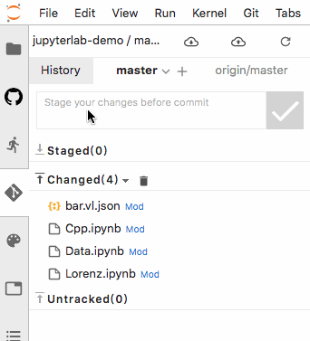
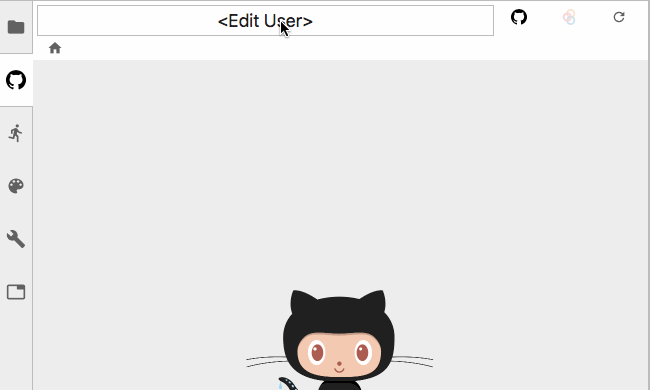
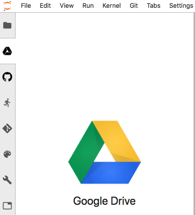
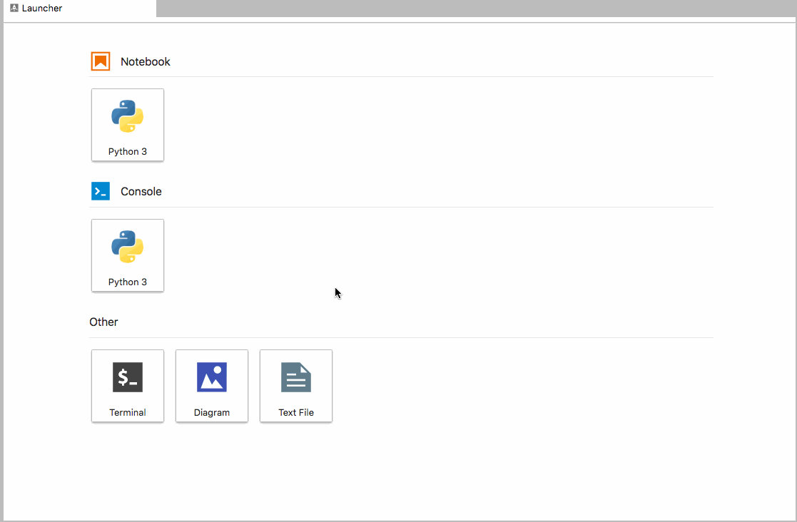
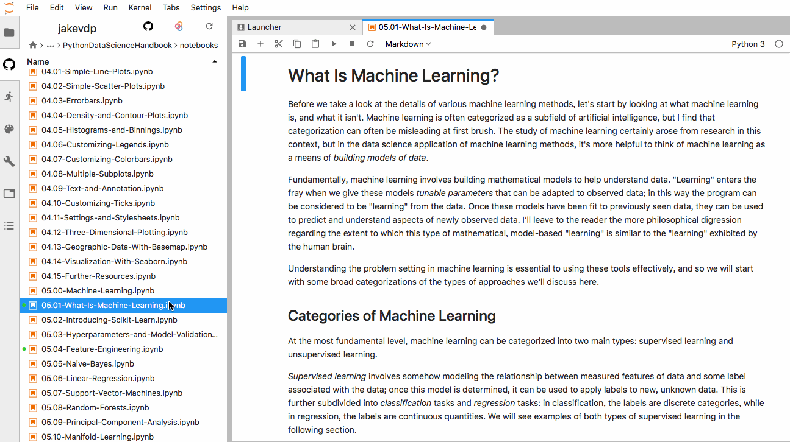

# awesome-jupyterlab-extension 

😎 A curated list of awesome Jupyterlab extension projects.

<!-- START doctoc generated TOC please keep comment here to allow auto update -->
<!-- DON'T EDIT THIS SECTION, INSTEAD RE-RUN doctoc TO UPDATE -->
**Table of Contents**  

*generated with [DocToc](https://github.com/thlorenz/doctoc)*

- [awesome-jupyterlab-extension *](#awesome-jupyterlab-extension-)
  - [Table of Contents](#table-of-contents)
  - [Version Control](#version-control)
    - [Jupyter Git](#jupyter-git)
    - [nbdime](#nbdime)
    - [jupyterlab_autoversion](#jupyterlab_autoversion)
  - [Remote Access](#remote-access)
    - [Github Extenion](#github-extenion)
    - [jupyterlab-google-drive](#jupyterlab-google-drive)
    - [jupyterlab-hub](#jupyterlab-hub)
  - [Formatting/Beautification](#formattingbeautification)
    - [jupyterlab_code_formatter](#jupyterlab_code_formatter)
  - [Write](#write)
    - [jupyterlab-vim](#jupyterlab-vim)
    - [JupyterLab LaTeX](#jupyterlab-latex)
    - [Jupyterlab-drawio](#jupyterlab-drawio)
    - [jupyterlab-monaco](#jupyterlab-monaco)
    - [jupyterlab_templates](#jupyterlab_templates)
    - [jupyterlab-go-to-definition](#jupyterlab-go-to-definition)
    - [jupyterlab_spellchecker](#jupyterlab_spellchecker)
    - [jupyterlab_spark](#jupyterlab_spark)
  - [Read/Interact](#readinteract)
    - [Jupyterlab-toc](#jupyterlab-toc)
    - [jupyterlab-dash](#jupyterlab-dash)
    - [jupyter-renderers](#jupyter-renderers)
    - [jupyter-matplotlib](#jupyter-matplotlib)
    - [jupyterlab_tensorboard](#jupyterlab_tensorboard)
    - [jupyter-widgets / ipywidgets](#jupyter-widgets--ipywidgets)
    - [Jupyterlab_voyager](#jupyterlab_voyager)
    - [ipyleaflet](#ipyleaflet)
    - [scriptedforms](#scriptedforms)
    - [knowledgelab](#knowledgelab)
    - [lantern](#lantern)
    - [itk-jupyter-widgets](#itk-jupyter-widgets)
    - [ipyp5](#ipyp5)
  - [Database](#database)
    - [jupyterlab-sql](#jupyterlab-sql)
    - [jupyterlab-omnisci](#jupyterlab-omnisci)
  - [Tools](#tools)
    - [mwouts / jupytext](#mwouts--jupytext)
    - [jupyterlab_email](#jupyterlab_email)
    - [JupyterLab Top Bar](#jupyterlab-top-bar)
    - [jupyterlab-sos](#jupyterlab-sos)
    - [jupyterlab_commands](#jupyterlab_commands)
  - [Theme](#theme)
    - [jupyterlab_materialdarker](#jupyterlab_materialdarker)
    - [jupyterlab_dracula](#jupyterlab_dracula)
    - [Jupyter-Atom-Dark-Theme](#jupyter-atom-dark-theme)
    - [jupyterlab_redpill_theme](#jupyterlab_redpill_theme)
    - [@telamonian/theme-darcula](#telamoniantheme-darcula)
    - [jupyterlab-gruvbox](#jupyterlab-gruvbox)
    - [JupyterLab AixViPMaP theme](#jupyterlab-aixvipmap-theme)
  - [How to Contribute](#how-to-contribute)
  - [License](#license)

<!-- END doctoc generated TOC please keep comment here to allow auto update -->

## Version Control

### Jupyter Git

A JupyterLab extension for version control using git.

### [nbdime](https://github.com/jupyter/nbdime)

Tools for diffing and merging of Jupyter notebooks.

### jupyterlab_autoversion

Automatically version jupyter notebooks in JupyterLab.

## Remote Access
### [Github Extenion](https://github.com/jupyterlab/jupyterlab-github)

GitHub integration for JupyterLab.

### [jupyterlab-google-drive](https://github.com/jupyterlab/jupyterlab-google-drive)

 Cloud storage for JupyterLab through Google Drive.

### [jupyterlab-hub](https://github.com/jupyterhub/jupyterlab-hub)
JupyterLab extension for running JupyterLab with JupyterHub

## Formatting/Beautification

### [jupyterlab_code_formatter](https://github.com/ryantam626/jupyterlab_code_formatter)
A universal code formatter for JupyterLab.

variableinspector:Jupyterlab extension that shows currently used variables and their values. The goal is to provide a tool similar to the variable inspector in RStudio.

## Write

### [jupyterlab-vim](https://github.com/jwkvam/jupyterlab-vim)

Vim notebook cell bindings for JupyterLab.

### [JupyterLab LaTeX](https://github.com/jupyterlab/jupyterlab-latex)

An extension for JupyterLab which allows for live-editing of LaTeX documents.

[Latex](https://github.com/jupyterlab/jupyterlab-latex/raw/master/images/show_preview.png)

### [Jupyterlab-drawio](https://github.com/QuantStack/jupyterlab-drawio)

A standalone embedding of the FOSS drawio / mxgraph package into jupyterlab.

### [jupyterlab-monaco](https://github.com/jupyterlab/jupyterlab-monaco)
A JupyterLab extension providing the Monaco editor.

### [jupyterlab_templates](https://github.com/timkpaine/jupyterlab_templates)

Support for jupyter notebook templates in jupyterlab.

### [jupyterlab-go-to-definition](https://github.com/krassowski/jupyterlab-go-to-definition)

Jump to definition of a variable or function in JupyterLab notebook and file editor. 

### [jupyterlab_spellchecker](https://github.com/ijmbarr/jupyterlab_spellchecker)

A spell checker extension for markdown cells in jupyterlab notebooks. Highlights misspelled words.

### [jupyterlab_spark](https://github.com/manuzhang/jupyterlab_spark)
A JupyterLab extension to show Spark Application UI in a JupyterLab panel.

## Read/Interact

### [Jupyterlab-toc](https://github.com/jupyterlab/jupyterlab-toc)

Table of Contents extension for JupyterLab.

### [jupyterlab-dash](https://github.com/plotly/jupyterlab-dash)
An Extension for the Interactive development of Dash apps in JupyterLab

### [jupyter-renderers](https://github.com/jupyterlab/jupyter-renderers)

This is a [monorepo](https://github.com/lerna/lerna#what-does-a-lerna-repo-look-like) that consists of generic renderers for common file types and mime types as well as renderer extensions for [JupyterLab](https://github.com/jupyterlab/jupyterlab).

### [jupyter-matplotlib](https://github.com/matplotlib/jupyter-matplotlib)

Leveraging the Jupyter interactive widgets framework, jupyter-matplotlib enables the interactive features of matplotlib in the Jupyter notebook and in Jupyterlab.

### [jupyterlab_tensorboard](https://github.com/chaoleili/jupyterlab_tensorboard)
A JupyterLab extension for tensorboard.

### [jupyter-widgets / ipywidgets](https://github.com/jupyter-widgets/ipywidgets)

ipywidgets are [interactive HTML widgets](https://github.com/jupyter-widgets/ipywidgets/blob/master/docs/source/examples/Index.ipynb) for Jupyter notebooks and the IPython kernel. Notebooks come alive when interactive widgets are used. Users gain control of their data and can visualize changes in the data.

### [Jupyterlab_voyager](https://github.com/altair-viz/jupyterlab_voyager)

JupyterLab extension visualize data with Voyager.

### ipyleaflet
A Jupyter / Leaflet bridge enabling interactive maps in the Jupyter notebook.

### scriptedforms

Making GUIs easy for everyone on your team. The primary benefit is that front ends for Python code become easily accessible to everyone on your team. Easy to use, easy to update, easy to extend, and easy to understand.

### [knowledgelab](https://github.com/timkpaine/knowledgelab)
Seamless integration of [Knowledge-Repo](https://github.com/airbnb/knowledge-repo) and [JupyterLab](https://github.com/jupyterlab/jupyterlab). The Knowledge Repo project is focused on facilitating the sharing of knowledge between data scientists and other technical roles using data formats and tools that make sense in these professions. 

### lantern

An orchestration layer for plots and tables, dummy datasets, widgets, research, reports, and anything else a data scientist might need.

### [itk-jupyter-widgets](https://github.com/InsightSoftwareConsortium/itk-jupyter-widgets)
Interactive [Jupyter](https://jupyter.org/) widgets to visualize images in 2D and 3D.

### [ipyp5](https://github.com/jtpio/ipyp5)
[p5.js](https://p5js.org/) in the Jupyter Notebook using the Jupyter Widgets.

## Database

### [jupyterlab-sql](https://github.com/pbugnion/jupyterlab-sql)
JupyterLab extension for interacting with SQL databases.

  

### [jupyterlab-omnisci](https://github.com/Quansight/jupyterlab-omnisci)
Connect to OmniSci, query their databases, and render the OmniSci-flavored Vega specification, all within JupyterLab.

## Tools

### [mwouts / jupytext](https://github.com/mwouts/jupytext)
Jupyter notebooks as Markdown documents, Julia, Python or R scripts.

### [jupyterlab_email](https://github.com/timkpaine/jupyterlab_email)
A jupyterlab extension to email notebooks from the browser.

### [JupyterLab Top Bar](https://github.com/jtpio/jupyterlab-topbar)
Monorepo to experiment with the top bar space in JupyterLab. Similar to the [status bar](https://github.com/jupyterlab/jupyterlab/tree/master/packages/statusbar-extension), the top bar can be used to place a few indicators and optimize the overall space.

### [jupyterlab-sos](https://github.com/vatlab/jupyterlab-sos)
Jupyterlab extension for SoS Polyglot Notebook and Workflow Engine, allows multiple kernels in one notebook.

### [jupyterlab_commands](https://github.com/timkpaine/jupyterlab_commands)
Support for arbitrary python commands in the command palette.

## Theme

### [jupyterlab_materialdarker](https://github.com/oriolmirosa/jupyterlab_materialdarker)
Material Darker JupyterLab Extension.

### [jupyterlab_dracula](https://github.com/karosc/jupyterlab_dracula)
Dracula Theme for JupyterLab.

### [Jupyter-Atom-Dark-Theme](https://github.com/BurglarBenson/Jupyter-Atom-Dark-Theme)
A dark theme for Jupyter Lab with accompanying Matplotlib theme.

### [jupyterlab_redpill_theme](https://github.com/JosCline/jupyterlab_redpill_theme)
A JupyterLab theme based on the 1999 movie, The Matrix.

### [@telamonian/theme-darcula](https://github.com/telamonian/theme-darcula)
Darcula theme for Jupyterlab. Modelled after the classic Intellij theme. 

### [jupyterlab-gruvbox](https://github.com/theolamayo/jupyterlab-gruvbox)
Gruvbox theme and colorscheme for JupyterLab and Matplotlib.

### [JupyterLab AixViPMaP theme](https://github.com/AixViPMaP/jlab-theme)
A JupyterLab theme extension which provides the AixViPMaP theme.

## How to Contribute

Your contributions are always welcome! Please take a look at the [contribution guidelines](contributing.md) first.

## License

